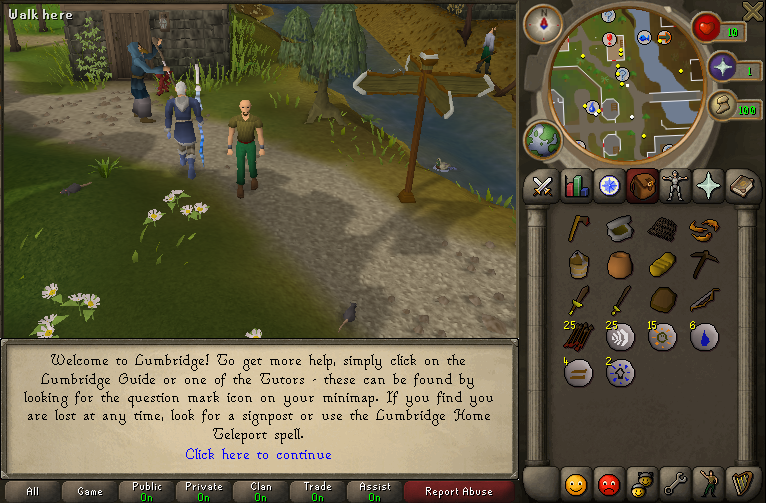

530-Runescape-Singleplayer-Server-Emulation




Singleplayer package is a fully self-contained, cross-platform release of the RuneScape experience.  
It allows you to play without connecting to any online servers. Ideal for **modding**, **experimentation**, or simply reliving the experience privately.

---

### What's Included

- **Pre-configured server and client** – ready to run out-of-the-box.
- **Default world data** – a working world with standard NPCs, skills, and economy.
- **Optional plugins** – client and server enhancements to extend gameplay.
- **Editor-530** – modify items, NPCs, and objects to customize the game.

---

### Setup Instructions

1. **Download [this repository](https://github.com/szumaster3/530-singleplayer/archive/refs/heads/master.zip) and extract the package**
    - Avoid paths with spaces (e.g., `C:\Users\My Name\Documents\`).
    - Use simple paths like `C:\Singleplayer` or Desktop.

2. **Run the server**
   ```bash
   # Windows
   run-server.bat

   # Linux/Mac
   ./run-server.sh
   ```
   > Wait until the console shows: `[00:00:00]: [Server] RuneScape started in [Number] milliseconds.`.

3. **Launch the client**
   ```bash
   # Windows
   run-client.bat

   # Linux/Mac
   ./run-client.sh
   ```
   > Log in with any username/password – a new account will be created automatically.

> [!NOTE]  
> The password is not saved.

---

### Configuration

- **Main config file:** `game/worldprops/default.conf`
  > After saving changes, **restart the server** for changes to take effect.

- **Experience rate:**

  > Default value: `exp_multiplier = 1.0` This is the global experience rate used by the server.
  > Per-player experience rate (save-based):
  > You can override the experience rate for a specific player by editing their save file.

#### Steps:

1. Log out of the game (make sure the player is fully saved).

2. Open the player save file: `game/data/players/`<your_username>.json
  > Locate the following field: `"exp_multiplier": 1.0` and change the value to your desired rate.
  > Save the file and log back into the game.

This change affects only the selected player and does not require a server restart.

[!INFO]
This change affects only the selected player and does not require a server restart.

- **Grand Exchange autostock:**
    - Default items added on server start are located in:  
      `game/data/eco/ge_autostock.json`
    - You can edit this file to add/remove default GE items.

> [!IMPORTANT]
> - Modifying internal configs is **at your own risk**.
> - If issues occur after editing server files, revert to the original versions.
> - Avoid installing in `Program Files` or other protected system directories.

---

### Plugins

> The `plugins.zip` inside `/game/` contains a collection of optional client qol.

#### How to install plugins:

1. Extract a plugin folder from `plugins.zip`
2. Move it to `game/plugins/`
3. Launch the client – the plugin will **load automatically**

> [!TIP]
> Plugins can enhance your experience by:
> - Adding xp drops & globes
> - Identify clue scrolls difficulty
> - Remember login<br>
> - Slayer tracking and much more.

---

### Folder structure overview

```
Singleplayer/
├─ game/
│  ├─ worldprops/default.conf     # Main server config
│  ├─ data/
│  │  ├─ players/                 # Player save files
│  │  └─ eco/ge_autostock.json    # Default GE items
│  ├─ plugins/                    # Extracted plugins go here
│  └─ plugins.zip                 # Optional plugin archive
├─ run-server.bat
├─ run-server.sh
├─ run-client.bat
└─ run-client.sh
```

> [!IMPORTANT]
> - Use **simple installation paths** to avoid file permission issues.
> - Keep a **backup of original configs** before modifying.

---

### Quick start summary

> 1. Extract package to a simple folder
> 2. Start server (`run-server.bat` / `./run-server.sh`)
> 3. Launch client (`run-client.bat` / `./run-client.sh`)
> 4. Log in with any username
> 5. Edit configs if needed (`default.conf`, `ge_autostock.json`)
> 6. Add optional plugins in `game/plugins/`

### Aditional information

- Fork of <a href="https://gitlab.com/2009scape/singleplayer/windows">2009Scape</a>.